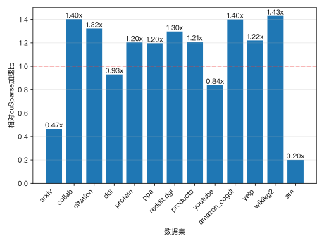
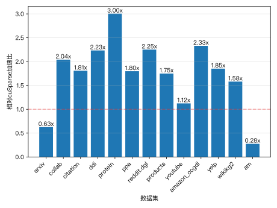
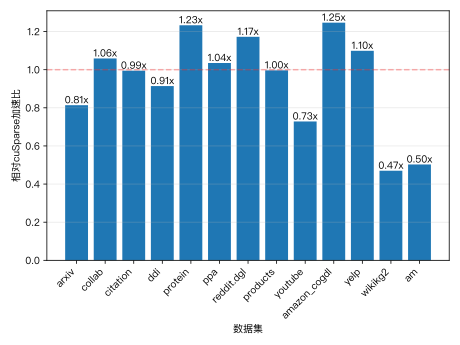
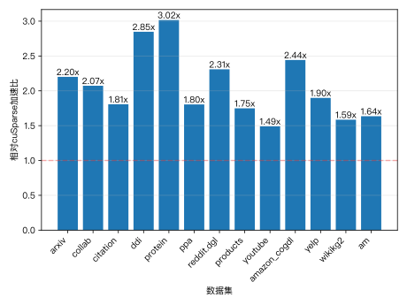
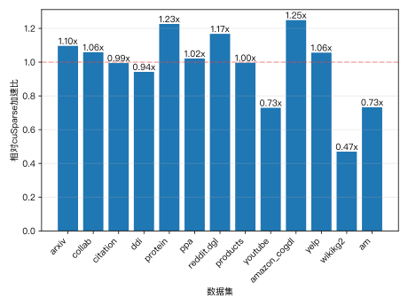
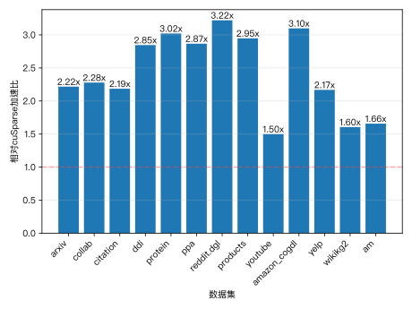
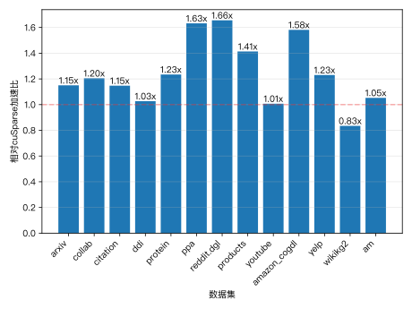

# 实验三：稀疏矩阵-矩阵乘

## 实现方法

### 减少 Warp Divergence

参考实现中，每个线程处理一整行稀疏矩阵，在行非零元素分布不均时，导致同一 warp 内线程执行时间差异较大，出现严重的 warp divergence。

为了解决这个问题，我将并行维度由“每线程一行”转变为“每 warp 处理一行、每线程处理一个或多个非零元”，利用共享内存缓存一个 warp 内待处理的非零元素及其位置，所有线程协同完成该行的计算。这样显著缓解了 divergence 问题，并提升了计算密度。

此外，我还为 len=256 时的某些数据集设计了双倍特征维度处理（即每线程计算两个输出特征维度），进一步提升每线程的计算强度，减少访存开销。

### 利用共享内存缓存

在 kernel 中我使用共享内存缓存非零元素的索引和数值。这样一来，同一个 warp 内线程访问这些数据时不需要多次访问全局内存，从而减少了内存带宽压力，并显著提升了访存效率。

### 改善数据局部性

对于部分图结构不规则的情况（如 arxiv, ddi 等），我引入了数据重排的策略。在 preprocess 阶段，我按照列顺序对原始稀疏矩阵的行重排，并同时更新稀疏矩阵的数据结构（ptr、idx、val）和行索引列表。这种重排增强了稠密矩阵读取时的局部性，使得多个线程更有可能访问到相邻的 vin 行，从而更好地利用 L1/L2 缓存，降低 global memory latency。

### 减少 Load Imbalance

对于极度稀疏或极度不平衡的稀疏矩阵，我在 preprocess 中将每一行按 SLICE_SIZE（如 32）切分为多个子任务，每个子任务由不同的线程块处理，并最终汇总输出结果。

这种方式避免了某些线程因处理超长行而拖慢整个 warp/block 的执行速度，实现了更均衡的任务划分。同时也提升了线程利用率，适用于稀疏度分布极端的场景。

## 不同优化对性能产生的影响

我首先根据题目要求实现了一个较为朴素的版本，将每一行稀疏矩阵分配给一个 warp，并利用 warp 内线程并行计算该行的输出特征维度，得到了如下的结果（len=32）：

可以看到，在许多数据集上略有超越 cuSparse 的实现，但在一些数据集上仍然有较大的差距。但是总体离要求的性能线还很远。

接下来，我决定尝试进一步提升数据重用与内存访问效率。我设置了共享内存来缓存边的信息，减少了全局内存访问冗余、提升了线程并行粒度与数据重用率，得到了如下的结果（len=32）：

当len=256时，结果如下：

得到了进一步的提升，但是在arxiv、am数据集上以及len=256时效果不太好。

为了解决arxiv、am数据集上性能不佳的问题，我尝试了将每一行划分为若干子任务，每个子任务由不同线程块独立处理。结果如下（len=32）：

为了解决len=256时性能不佳的问题，我尝试了双倍特征维度处理的策略，即每个线程计算两个输出特征维度。结果如下（len=32）：

当len=256时，结果如下：

事实证明，这一举措有效解决了长行拖慢整个 warp/block 执行时间的问题，提高线程利用率，优化了极端不均衡图的数据集的性能。同时在 INFEATURE=256 时小幅提升了吞吐能力。

当我想要进一步进行优化时，我发现稀疏矩阵自身的结构成了很大的阻碍。所以我尝试在预处理阶段对稀疏矩阵进行重排，将行按照列顺序重新排列，并更新稀疏矩阵的 ptr、idx、val 等数据结构。这样可以提升数据局部性，减少访存延迟。最后得到了最终结果。

最终结果：

当len=32时，结果如下：

当len=256时，结果如下：

## 在 $len = 32, 256$ 时的运行时间，及相对于 cuSparse 实现的加速比

### len=32 时的运行时间和加速比

| dataset      | 运行时间/us | cuSparse加速比 | 性能线加速比 | 吞吐量     |
| ------------ | ----------- | -------------- | ------------ | ---------- |
| arxiv        | 347.86      | 2.21645777     | 1.0061519    | 3352621744 |
| collab       | 583.872     | 2.278016415    | 1.061876576  | 4038734517 |
| citation     | 7525.57     | 2.185336127    | 1.182634671  | 4037965895 |
| ddi          | 225.194     | 2.845653081    | 1.110153912  | 9484364592 |
| protein      | 8169.56     | 3.020480907    | 1.003726027  | 9685038607 |
| ppa          | 6414.36     | 2.866256337    | 1.371921751  | 6620124533 |
| reddit.dgl   | 15071.2     | 3.220466851    | 1.127979192  | 7604961184 |
| products     | 18939.5     | 2.947189736    | 1.689590538  | 6532288603 |
| youtube      | 2431.62     | 1.498848504    | 1.151495711  | 2459630205 |
| amazon_cogdl | 40450.5     | 3.098601995    | 1.087749224  | 6534887529 |
| yelp         | 3033.91     | 2.168093319    | 1.120666071  | 4599615348 |
| wikikg2      | 4465.47     | 1.604948639    | 0.985338609  | 3607499770 |
| am           | 2255.61     | 1.657081676    | 1.019679821  | 2513148106 |

平均吞吐量为 5.47e9。

### len=256 时的运行时间和加速比

| dataset      | 运行时间/us | cuSparse加速比 | 性能线加速比 | 吞吐量      |
| ------------ | ----------- | -------------- | ------------ | ----------- |
| arxiv        | 2602.6      | 1.15           | 0.960577884  | 448106893.1 |
| collab       | 4318.96     | 1.204898865    | 1.041917499  | 545988849.2 |
| citation     | 68887.2     | 1.147259578    | 1.016153944  | 441126871.2 |
| ddi          | 1511.45     | 1.027152734    | 0.992424493  | 1413094710  |
| protein      | 65491.4     | 1.234191054    | 1.98499345   | 1208135786  |
| ppa          | 52003.7     | 1.632256936    | 1.538352079  | 816554629.8 |
| reddit.dgl   | 122195      | 1.655902451    | 1.309382544  | 937975293.6 |
| products     | 182827      | 1.413472846    | 1.367412909  | 676695892.8 |
| youtube      | 14320.8     | 1.007234233    | 1.117256019  | 417636305.2 |
| amazon_cogdl | 327281      | 1.581558355    | 1.222191328  | 807683513.6 |
| yelp         | 24374.8     | 1.23047984     | 1.107701397  | 572510092.4 |
| wikikg2      | 19921.3     | 0.834845116    | 1.254938182  | 808641102.7 |
| am           | 12719.5     | 1.05273006     | 1.022052754  | 445668619   |

平均吞吐量为 7.34e8。
