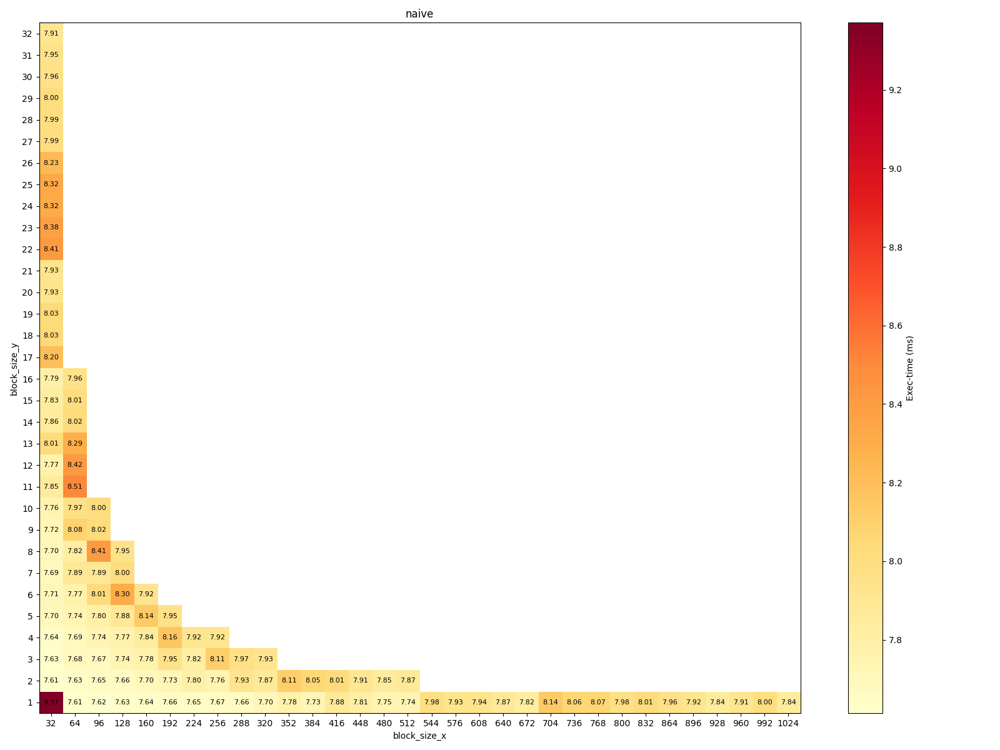
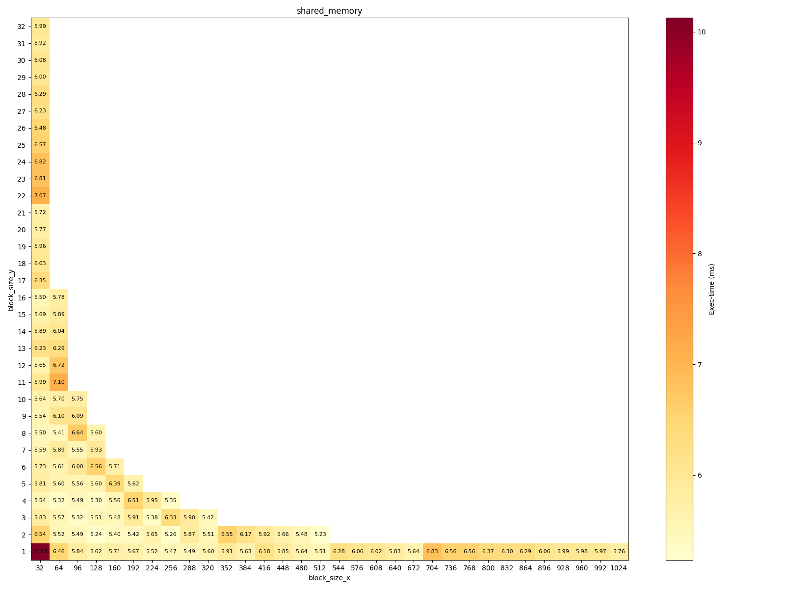
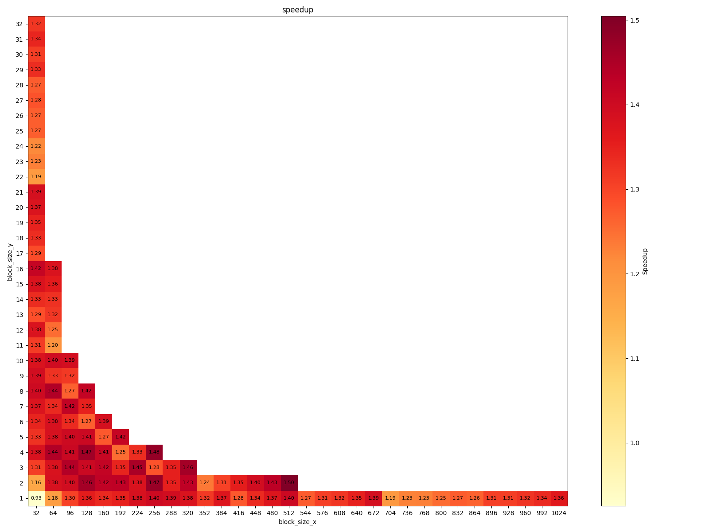

# 小作业四：CUDA 并行策略 (thread block, shared memory)

## 测量结果

不使用 shared memory 的情况下，程序完成计算所需的时间（单位：ms）：

使用 shared memory 的情况下，程序完成计算所需的时间（单位：ms）：

二者的加速比：

## 分析

### 不同的 thread block size 的选取，对程序性能的影响

当 thread block size 较小时（例如 block size 为 32x1），线程调度数目虽然多，但每个 block 中计算资源利用率较低，导致整体性能不佳。

当 block size 增加到适中程度时，充分利用了 SM 的并行资源，同时保持了较高的 occupancy，从而达到最佳的运行效率。

block size 过大可能导致资源（如寄存器和共享内存）的竞争加剧，从而引起部分线程的等待，反而使性能下降。

### Shared memory 是否使用，对程序性能的影响

对于计算密集型且数据局部性较好的部分，使用 shared memory 能显著降低对全局内存的访问延迟，提高执行效率。

但在一些访问模式较为简单或数据局部性不明显的情形下，比如 block size 很小时（如测试用例中的 32x1），由于 shared memory 会有额外的耗时，shared memory 的分配和管理开销可能抵消其带来的加速效果，甚至略微降低性能。

### 上述两者的相互影响

Shared memory 在 block size 达到一定规模后，便能显著提升性能。对于 block size 较小的情况，shared memory 的使用可能会导致性能下降。

在测试用例下，shared memory 只有在 block size 为 32x1 时，性能有所下降，其他情景下均有提升。可以认为，block size 的增大使得数据局部性增强，shared memory 的使用能显著提升性能。

### 对于这个程序

#### 如何设置 thread block size 才可以达到最好的效果？为什么？

Thread block size 应当适中，以追求充分利用 SM 的性能、发挥 shared memory 的优势。

就测试用例而言，设置为 128x2 或 512x2 的 block size 并启用 shared memory 时，性能均较好。

#### Shared memory 总是带来优化吗？如果不是，为什么？

不一定。如果 block size 较小，创建和维护 shared memory 的开销可能会抵消甚至超过其带来的性能提升。如测试用例中，block size 为 32x1 时，使用 shared memory 的性能反而略低于不使用的情况。

#### Shared memory 在什么 thread block size 下有效果，什么时候没有？

在 block size 较小的情况下，shared memory 的使用可能会导致性能下降。随着 block size 的增大，数据局部性增强，shared memory 的使用能显著提升性能。

在测试用例中，block size 为 32x1 时，使用 shared memory 的性能反而略低于不使用的情况；而在其他情况下，使用 shared memory 的性能均较好。

#### 还有哪些可以优化的地方？

或许可以改善全局内存访问方式，或者合理安排数据在 shared memory 与寄存器之间的分布，进一步减少内存延迟。同时精简不必要的线程同步，减少同步开销。

### 对于任意一个给定程序：

#### 应该如何设置 thread block size？

Block size 应当适中，使得任务分配尽量均匀。

#### 应该如何决定 shared memory 的使用？

当 block size 较大时，数据局部性增强，shared memory 的额外开销会被其带来的性能提升所抵消。故在 block size 较大时，使用 shared memory 是有利的。

## 附录：全部数据

| block size |   naive    | shared_memory |
| :--------: | :--------: | :-----------: |
|    32x1    | 9.37083 ms |  10.1267 ms   |
|    32x2    | 7.61377 ms |  6.53704 ms   |
|    32x3    | 7.62594 ms |  5.82732 ms   |
|    32x4    | 7.64207 ms |  5.53604 ms   |
|    32x5    | 7.69938 ms |  5.80789 ms   |
|    32x6    | 7.70582 ms |  5.73249 ms   |
|    32x7    | 7.68737 ms |  5.59456 ms   |
|    32x8    | 7.70204 ms |  5.49521 ms   |
|    32x9    | 7.72194 ms |  5.54494 ms   |
|   32x10    | 7.75598 ms |  5.63705 ms   |
|   32x11    | 7.85222 ms |  5.98509 ms   |
|   32x12    | 7.77236 ms |  5.64895 ms   |
|   32x13    | 8.0149 ms  |  6.22586 ms   |
|   32x14    | 7.85725 ms |  5.89023 ms   |
|   32x15    | 7.83473 ms |  5.69037 ms   |
|   32x16    | 7.78814 ms |   5.5019 ms   |
|   32x17    | 8.19946 ms |  6.35103 ms   |
|   32x18    | 8.03446 ms |   6.0338 ms   |
|   32x19    | 8.02714 ms |   5.956 ms    |
|   32x20    | 7.93117 ms |  5.77126 ms   |
|   32x21    | 7.93047 ms |  5.71807 ms   |
|   32x22    | 8.41095 ms |  7.07386 ms   |
|   32x23    | 8.3771 ms  |  6.81498 ms   |
|   32x24    | 8.31715 ms |  6.82061 ms   |
|   32x25    | 8.32352 ms |  6.56643 ms   |
|   32x26    | 8.22774 ms |  6.48315 ms   |
|   32x27    | 7.99179 ms |  6.22992 ms   |
|   32x28    | 7.99428 ms |   6.2931 ms   |
|   32x29    | 7.99968 ms |  6.00494 ms   |
|   32x30    | 7.95703 ms |   6.077 ms    |
|   32x31    | 7.94739 ms |  5.91819 ms   |
|   32x32    | 7.91444 ms |  5.99286 ms   |
|    64x1    | 7.61273 ms |   6.4558 ms   |
|    64x2    | 7.63367 ms |  5.51696 ms   |
|    64x3    | 7.67965 ms |  5.56759 ms   |
|    64x4    | 7.68797 ms |  5.32255 ms   |
|    64x5    | 7.74443 ms |  5.60139 ms   |
|    64x6    | 7.77233 ms |  5.61446 ms   |
|    64x7    | 7.88612 ms |   5.8889 ms   |
|    64x8    | 7.81548 ms |  5.41035 ms   |
|    64x9    | 8.08171 ms |   6.0956 ms   |
|   64x10    | 7.96637 ms |  5.70202 ms   |
|   64x11    | 8.51137 ms |  7.09594 ms   |
|   64x12    | 8.41713 ms |  6.72304 ms   |
|   64x13    | 8.28835 ms |  6.28573 ms   |
|   64x14    | 8.02412 ms |  6.04173 ms   |
|   64x15    | 8.00772 ms |  5.89265 ms   |
|   64x16    | 7.95585 ms |  5.77585 ms   |
|    96x1    | 7.61912 ms |  5.84335 ms   |
|    96x2    | 7.65427 ms |  5.48582 ms   |
|    96x3    | 7.67133 ms |  5.32052 ms   |
|    96x4    | 7.73721 ms |  5.49041 ms   |
|    96x5    | 7.79597 ms |  5.56244 ms   |
|    96x6    | 8.01134 ms |  5.99697 ms   |
|    96x7    | 7.88666 ms |  5.54659 ms   |
|    96x8    | 8.40755 ms |  6.64232 ms   |
|    96x9    | 8.02262 ms |  6.09379 ms   |
|   96x10    | 7.99748 ms |  5.75441 ms   |
|   128x1    | 7.62792 ms |  5.62116 ms   |
|   128x2    | 7.66423 ms |  5.24485 ms   |
|   128x3    | 7.74379 ms |  5.51056 ms   |
|   128x4    | 7.76569 ms |  5.29904 ms   |
|   128x5    | 7.88308 ms |  5.60403 ms   |
|   128x6    | 8.30329 ms |  6.56141 ms   |
|   128x7    | 8.00131 ms |  5.93021 ms   |
|   128x8    | 7.94769 ms |  5.60026 ms   |
|   160x1    |  7.64 ms   |  5.71069 ms   |
|   160x2    | 7.6965 ms  |  5.40106 ms   |
|   160x3    | 7.77526 ms |  5.47952 ms   |
|   160x4    | 7.84069 ms |  5.55524 ms   |
|   160x5    | 8.14102 ms |  6.38911 ms   |
|   160x6    | 7.92344 ms |  5.71314 ms   |
|   192x1    | 7.66051 ms |  5.67237 ms   |
|   192x2    | 7.73141 ms |  5.41582 ms   |
|   192x3    | 7.94907 ms |  5.91008 ms   |
|   192x4    | 8.15922 ms |  6.51493 ms   |
|   192x5    | 7.95374 ms |  5.61734 ms   |
|   224x1    | 7.64645 ms |  5.52438 ms   |
|   224x2    | 7.79623 ms |  5.65301 ms   |
|   224x3    | 7.81726 ms |  5.37879 ms   |
|   224x4    | 7.91826 ms |  5.94514 ms   |
|   256x1    | 7.66556 ms |  5.47169 ms   |
|   256x2    | 7.7576 ms  |  5.26149 ms   |
|   256x3    | 8.10753 ms |  6.32569 ms   |
|   256x4    | 7.91797 ms |  5.35199 ms   |
|   288x1    | 7.66223 ms |  5.49351 ms   |
|   288x2    | 7.92789 ms |  5.86733 ms   |
|   288x3    | 7.97462 ms |   5.8968 ms   |
|   320x1    | 7.70402 ms |  5.59762 ms   |
|   320x2    | 7.86735 ms |  5.51453 ms   |
|   320x3    | 7.92842 ms |  5.42492 ms   |
|   352x1    | 7.77551 ms |  5.90844 ms   |
|   352x2    | 8.11099 ms |  6.55016 ms   |
|   384x1    | 7.73365 ms |  5.63316 ms   |
|   384x2    | 8.05263 ms |  6.17001 ms   |
|   416x1    | 7.87602 ms |  6.17656 ms   |
|   416x2    | 8.01458 ms |  5.91605 ms   |
|   448x1    | 7.81077 ms |   5.8488 ms   |
|   448x2    | 7.90583 ms |  5.66437 ms   |
|   480x1    | 7.74937 ms |  5.64352 ms   |
|   480x2    | 7.85136 ms |  5.48447 ms   |
|   512x1    | 7.74056 ms |  5.51067 ms   |
|   512x2    | 7.87176 ms |  5.23174 ms   |
|   544x1    | 7.97872 ms |  6.28183 ms   |
|   576x1    | 7.93046 ms |  6.06422 ms   |
|   608x1    | 7.9355 ms  |  6.01527 ms   |
|   640x1    | 7.87054 ms |  5.82885 ms   |
|   672x1    | 7.82477 ms |  5.64025 ms   |
|   704x1    | 8.1351 ms  |  6.82906 ms   |
|   736x1    | 8.06226 ms |  6.56324 ms   |
|   768x1    | 8.06686 ms |  6.55601 ms   |
|   800x1    | 7.97635 ms |   6.3689 ms   |
|   832x1    | 8.01274 ms |  6.30261 ms   |
|   864x1    | 7.95687 ms |  6.29188 ms   |
|   896x1    | 7.91713 ms |  6.05595 ms   |
|   928x1    | 7.84461 ms |  5.99381 ms   |
|   960x1    | 7.91292 ms |  5.98303 ms   |
|   992x1    | 7.99584 ms |  5.97346 ms   |
|   1024x1   | 7.84271 ms |  5.75524 ms   |