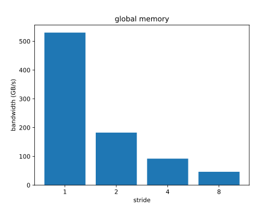
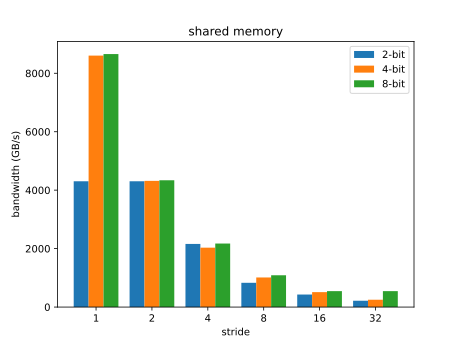

# 小作业六：CUDA 优化 (global memory, shared memory)

## 汇报你的测量结果，绘制图像，并回答以下问题

### 分析 `test_gmem.cu` 的性能变化来源

| Stride | Bandwidth |
| ------ | --------- |
| 1      | 530.126    |
| 2      | 182.488   |
| 4      | 91.9938   |
| 8      | 46.2865   |

#### 性能变化的主要来源是 GPU 的哪种机制引起的？

主要是 global memory 的访问合并（coalescing）机制。

#### 这种机制如何影响该程序的性能？

全局内存的带宽利用效率高度依赖于线程访问内存的模式。当多个线程访问的内存地址是连续的（或在允许范围内的偏移），这些访问可以被合并为一次 memory transaction，从而实现 memory coalescing。

当 stride = 1 时，访问是连续的，最容易被合并，因此带宽最高。随着 stride 增大，访问地址之间的间隔变大，访问越来越“稀疏”，无法合并，导致每个线程都需要单独发起一次访问，性能急剧下降。

#### 是否有其他的硬件功能参与了该程序的执行过程，它们会如何影响该程序的执行效率？

Global memory 访问会经过 L2 缓存。L2 缓存对程序的执行效率有所帮助，但当访问模式不规则（高 stride）时缓存命中率低，作用减弱。

此外，线程访问地址分散会导致内存调度器更频繁地切换事务，增加延迟。内存等待还可能造成 warp stall，此时 warp 调度器也可能影响整体吞吐量。

### 分析 `test_smem.cu` 的性能变化来源

<table>
  <tr>
    <th rowspan="2" colspan="2">Bandwidth</th>
    <th colspan="3">Bitwidth</th>
  </tr>
  <tr>
    <th>2</th>
    <th>4</th>
    <th>8</th>
  </tr>
  <tr>
    <th rowspan="6">Stride</th>
    <th>1</th>
    <td>4303.43</td>
    <td>8605.84</td>
    <td>8657.84</td>
  </tr>
  <tr>
    <th>2</th>
    <td>4303.47</td>
    <td>4318.84</td>
    <td>4339.36</td>
  </tr>
  <tr>
    <th>4</th>
    <td>2159.44</td>
    <td>2032.42</td>
    <td>2173.55</td>
  </tr>
  <tr>
    <th>8</th>
    <td>829.708</td>
    <td>1013.33</td>
    <td>1087.66</td>
  </tr>
  <tr>
    <th>16</th>
    <td>427.461</td>
    <td>511.083</td>
    <td>544.068</td>
  </tr>
  <tr>
    <th>32</th>
    <td>215.888</td>
    <td>250.972</td>
    <td>544.07</td>
  </tr>
</table>

#### 固定 `BITWIDTH` 时，程序的性能变化来源于哪种硬件机制？

主要来源于 shared memory 的 bank conflict。

共享内存分为多个 bank，每个线程访问不同 bank 时可以并行处理。但如果多个线程同时访问同一个 bank，就会发生冲突，导致序列化访问，性能下降。

当 stride 增大时，每个 warp 中线程访问的数据位于同一个 bank 的个数增加，导致序列化访问，相应地使运行时间成倍增加。

#### `BITWIDTH` 设置为 $2, 8$ 时性能变化的趋势相比于 `BITWIDTH` 设置为 $4$ 时有什么不同之处，请解释。

`BITWIDTH` 设置为 $4$ 时，性能成倍下降的趋势最为明显、典型，这是因为 shared memory 访存的单位就是 4Bytes。

`BITWIDTH` 设置为 $2$ 时，stride 为 1 或 2 时都不会发生冲突，因此此时的带宽基本一致。带宽整体是`BITWIDTH` 设置为 $4$ 时的情况的一半。

`BITWIDTH` 设置为 $8$ 时，sride 为 16 和 32 时，由于 warp 中所有线程都已经冲突了，已经是最坏情况，因此带宽没有进一步下降。由于 bank conflict 路数比 `BITWIDTH` 设置为 $4$ 时增大了一倍、以及本身数据量大了一倍，故带宽与 `BITWIDTH` 设置为 $4$ 时基本一致。
